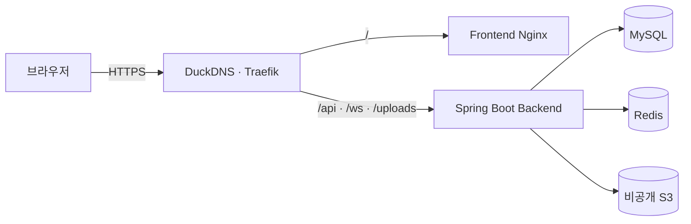

# 이웃톡 프런트엔드

[](https://github.com/gitUserKHS/talk_with_neighbors_front/actions/workflows/ci.yml)

관심사와 거리를 바탕으로 가까운 이웃의 이야기, 모임, 대화를 연결하는 React 19 + Vite 웹 애플리케이션입니다.

**운영 서비스:** [https://talk-with-neighbors.duckdns.org](https://talk-with-neighbors.duckdns.org)



## 핵심 사용자 흐름

- 로그인 전에는 공개 피드와 공개 모임을 둘러볼 수 있습니다.
- 이메일 또는 카카오 계정으로 로그인한 뒤 닉네임, 관심사, 동네를 설정할 수 있습니다.
- 추천·가까운·최신 기준으로 피드를 살펴보고 게시글, 사진·동영상, 댓글과 좋아요를 관리할 수 있습니다.
- 관심사가 맞는 이웃을 찾고 모임에 참여하며 채팅방에서 대화와 약속 일정을 관리할 수 있습니다.
- 마이페이지에서 활동, 공개 범위, 차단·숨김·신고 내역과 로그인 보안을 관리할 수 있습니다.
- 한국어와 영어 UI를 지원하며 선택한 언어는 브라우저에 저장됩니다.

## 로컬 실행

Node.js 22 사용을 권장합니다.

```bash
npm ci
npm run dev
```

백엔드 저장소가 같은 상위 폴더에 있다면 백엔드의 Compose 구성으로 전체 스택을 실행할 수 있습니다.

```bash
cd ../talk_with_neighbors_back
docker compose -f compose.local.yml up --build -d
```

프런트는 `http://localhost:3000`, API는 `http://localhost:8080`에서 확인할 수 있습니다. 종료할 때는 백엔드 저장소에서 다음 명령을 실행합니다.

```bash
docker compose -f compose.local.yml down
```

## 카카오 지도 설정

모임 생성·수정 화면에서 장소 검색과 지도 선택을 사용하려면 `.env.example`을 참고하여 `VITE_KAKAO_MAP_JAVASCRIPT_KEY`를 설정합니다. 카카오디벨로퍼스 앱에서 카카오맵을 활성화하고 JavaScript SDK 허용 도메인에 로컬 주소와 운영 origin인 `https://talk-with-neighbors.duckdns.org`를 등록해야 합니다.

JavaScript 키는 브라우저에서 지도 SDK를 호출하기 위한 플랫폼 키입니다. 소스에 직접 커밋하지 않고 로컬 환경 변수와 GitHub `VITE_KAKAO_MAP_JAVASCRIPT_KEY` 시크릿으로 주입하며, 허용 도메인 제한을 유지합니다. 키가 없는 개발·PR 빌드에서는 장소명과 안내 주소를 직접 입력하는 대체 UI가 표시됩니다. 현재 위치 기능은 브라우저 보안 정책에 따라 HTTPS 또는 localhost에서만 동작합니다.

- [카카오맵 시작하기](https://developers.kakao.com/docs/ko/kakaomap/common)
- [Kakao 지도 Web API 가이드](https://apis.map.kakao.com/web/guide/)

## 검증

```bash
npm test
npm run typecheck
npm run build
```

GitHub Actions는 PR과 관리 브랜치의 테스트, 타입 검사, 같은 출처(`/api`, `/ws`) 프로덕션 빌드와 Nginx 컨테이너 헬스 체크를 실행합니다. 검증을 통과한 `main`과 버전 태그 이미지만 GHCR에 게시됩니다.

프런트 `main` 이미지 게시가 완료되면 최소 권한 GitHub App이 백엔드 저장소에 배포 이벤트를 전달합니다. 백엔드 워크플로는 전달받은 digest를 검증하고 k3s의 프런트 Deployment만 교체합니다. 이 경로에서는 DB, Redis, 백엔드, Secret과 migration을 변경하지 않습니다.

로그인 세션은 `SameSite=Lax` HttpOnly 쿠키를 사용하므로 프런트와 API를 같은 사이트에서 제공합니다. 게시글과 채팅 미디어는 같은 출처의 `/uploads` 경로로 요청하며, 백엔드는 실행 환경에 따라 로컬 볼륨 또는 비공개 S3에서 파일을 제공합니다.
